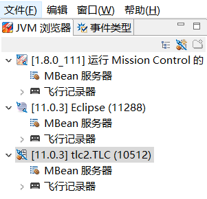
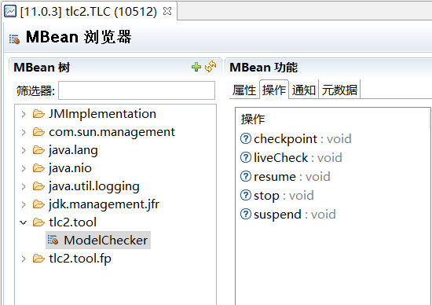

# TLC运行暂停

``` 本文档介绍如何暂停正在模型检测的Toolbox工具```

## 工具

### JMX

JMX(Java Management Extensions, Java管理扩展)是提供运行时动态管理资源服务的一个框架, 涉及的资源包括硬件设备、内存与CPU、运行服务器等等. 

在JMX技术中, 给定的资源有一个或者多个MBean(Managed Bean)的Java对象进行监控. 这些MBean对象需要在MBean服务器进行注册.

JMX中定义了五种类型的MBean:
- Standard MBeans
- Dynamic MBeans
- Open MBeans
- Model MBeans
- MXBeans
常用的是Standard MBeans和Dynamic MBeans.

### JMC

JMC(Java Mission Control)用以监视和管理Java应用程序, 并且不会引用与这些类型工具相关联的开销. JMX是JMC其中一个插件.

JMC客户端目录位置:`JAVA_HOME/bin/jmc.exe`

## TLC实现

TLC实现了Standard MBeans([TLCStandardMBean](https://github.com/tlaplus/tlaplus/blob/master/tlatools/src/tlc2/tool/management/TLCStandardMBean.java)), 同时在此基础上提供了JMX API([ModelCheckerMXWrapper](https://github.com/tlaplus/tlaplus/blob/master/tlatools/src/tlc2/tool/management/ModelCheckerMXWrapper.java)), 具体包括checkpoint(设置检查点)、liveCheck(和liveness相关)、stop(停止运行)、suspend(暂停运行)、resume(继续执行)等方法.

## 使用方法

1. 使用Toolbox运行模型检验实验
2. 打开JMC, 此时JMX将自动连上运行toolbox的JVM并且进行检测管理(左侧JVM浏览器中的tlc2.TLC), 打开其中的MBean服务器
          
3. MBeans服务器中有TLC已经实现的方法, tlc2.tool及tlc2.tool.fp. 在tlc2.tool中我们能够使用上述提到的五个方法, 包括暂停功能, 点击并执行就能实现TLC的暂停.
   

## TODO
- [ ] 编写脚本使用JMX管理正在运行的TLC程序, 而不是通过JMC进行控制.
- [ ] 暂停后如何获取当前的所有状态以及可执行的动作?
- [ ] 点击选定的动作后如何使得程序执行该选定的动作?